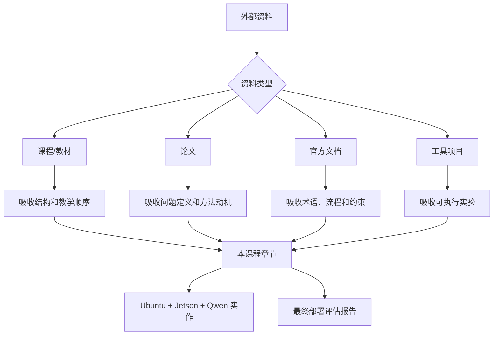

# 资料对比与课程取舍

## 建议学时

2 学时。

本页适合放在课程导读或教师备课阶段使用。它回答一个关键问题：为什么本课程不是简单拼接量化论文、runtime 文档、Jetson 教程和 LLM 实作，而要重新组织成一门端侧部署课程。

## 本页目标

本课程参考公开课程、在线教材、论文和官方文档，但不会照搬任何一个来源。我们要做的是：吸收它们对知识结构、方法边界、实验设计和工程指标的优点，同时去掉不适合本课程目标的内容。

课程目标是端侧模型量化部署，不是泛 AI 课程、论文综述课、厂商 API 手册或数据中心 serving 课程。

## 取舍原则

| 原则 | 保留 | 舍弃 |
| --- | --- | --- |
| 面向部署 | 真实设备、runtime、profiling、功耗、稳定性 | 只在论文 benchmark 中成立的结论 |
| 面向课程 | 可讲、可学、可实验、可复盘 | 零散命令堆砌 |
| 面向端侧 | 内存、带宽、功耗、Jetson、边缘设备、端云协同 | 纯云端高并发集群优化 |
| 面向工程判断 | 方法适用条件、风险、失败模式 | 只给“最佳实践”口号 |
| 面向项目产出 | 部署评估报告、实验表格、复盘问题 | 只展示 demo 成功 |

## 对比框架



这张图强调：不同资料的价值不同。课程资料提供结构，论文提供方法动机，官方文档提供可靠术语和流程，工具项目提供可执行实验。

## 资料对比

| 来源 | 取其精华 | 去其糟粕 |
| --- | --- | --- |
| MIT 6.5940 / EfficientML | 高效模型、量化、剪枝、硬件感知优化的课程骨架 | TinyML 电路级和硬件设计细节不作为主线 |
| The Machine Learning Systems Book | 指标、部署、可靠性、性能评估、系统边界 | 泛 MLOps、组织流程、平台治理不展开 |
| Hugging Face LLM Course | tokenizer、Transformer、生成、chat template 基础 | 训练/微调长线内容只保留必要背景 |
| PyTorch / ONNX / TFLite / OpenVINO | PTQ/QAT、校准、静态/动态量化、误差分析 | 不做逐 API 讲解，避免成为工具手册 |
| GPTQ / AWQ / SmoothQuant / LLM.int8 | LLM 量化方法动机、误差来源、outlier 处理 | 复杂证明和榜单复述不作为课堂重点 |
| llama.cpp / Qwen | GGUF、本地 LLM、server、benchmark、低比特实作 | 不追逐全部模型格式和参数枚举 |
| vLLM / TensorRT-LLM / MLC LLM | KV Cache、服务化、GPU/跨平台部署思路 | 高并发集群级 serving 只作为延伸 |
| Jetson / JetPack / TensorRT | 边缘设备环境、功耗、`tegrastats`、TensorRT、DLA 概念 | 不展开所有 Jetson 型号和硬件细节 |
| MLPerf / Nsight / llama-bench | profiling 和 benchmark 方法 | 竞赛级 benchmark 流程不作为必做实验 |
| VLM / Agent 资料 | 组件拆解、工具权限、端云协同、失败恢复 | 追逐快速变化的框架接口和营销式 agent demo |

## 吸收到课程结构中

| 课程部分 | 主要吸收来源 | 课程化处理 |
| --- | --- | --- |
| 前置知识 | Hugging Face、ML Systems Book | 用 tokenizer、prefill/decode、latency/memory 建立共同语言 |
| 端侧部署框架 | ML Systems Book、EfficientML、Jetson docs | 把质量、延迟、内存、功耗、维护成本放到同一决策表 |
| 量化压缩 | PyTorch、ONNX、TFLite、OpenVINO、GPTQ/AWQ/SmoothQuant | 用方法路线和失败模式组织，不按 API 罗列 |
| 推理加速 | TensorRT、TensorRT-LLM、vLLM、llama.cpp、MLC LLM | 从图、kernel、memory、runtime、hardware 五层讲 |
| Ubuntu / Jetson 实作 | Qwen、llama.cpp、Jetson、NVIDIA 文档 | 统一落到 Qwen 小模型部署评估报告 |
| Profiling | MLPerf、Nsight、llama-bench、`nvidia-smi`、`tegrastats` | 建立课堂可操作的实验记录模板 |
| VLM / Agent | HF 多模态、OpenAI tool/agent 文档、系统资料 | 讲系统设计、权限和端云协同，不做完整平台课 |

## 课程主线的形成

外部资料覆盖面很广，本课程把它们收束成一条主线：


这条主线的好处是每个知识点都有落点：

- 学 tokenizer，是为了理解本地模型输入格式和上下文。
- 学 KV Cache，是为了解释内存和首 token/tokens/s。
- 学 PTQ/QAT，是为了理解模型质量和部署格式。
- 学 runtime，是为了理解模型为什么“能跑但不快”。
- 学 Jetson，是为了看到功耗、温度和边缘硬件限制。
- 学 VLM/Agent，是为了从单模型走向系统设计。

## 为什么保留 7 部分结构

7 部分结构能把课程从“大纲列表”变成“完整学习路径”。

| 部分 | 功能 | 如果删除会怎样 |
| --- | --- | --- |
| 导读 | 说明课程定位、资料取舍和学时 | 学生不知道课程边界 |
| Part I 前置知识 | 补齐 LLM、系统、Linux/GPU 基础 | 实作时只会复制命令 |
| Part II 端侧部署框架 | 建立决策矩阵和端云协同视角 | 量化和 runtime 会变成零散技巧 |
| Part III 量化与压缩 | 讲模型侧优化 | 无法解释低比特、PTQ/QAT 和精度风险 |
| Part IV 推理加速与 Runtime | 讲执行侧优化 | 无法解释速度瓶颈和硬件后端 |
| Part V Ubuntu / Jetson 实作 | 建立可验证经验 | 课程会停留在理论 |
| Part VI 案例复盘 | 形成项目报告和评审能力 | 学生缺少收束和迁移能力 |

## 为什么体量要做到 40+ 学时

如果只讲量化概念和几个命令，8 到 12 学时也能完成。但那样学生通常只能获得“跑过一次 demo”的经验。

要让学生具备端侧部署判断能力，至少需要覆盖：

| 能力 | 需要内容 | 不足时的表现 |
| --- | --- | --- |
| 理解模型输入输出 | tokenizer、chat template、prefill/decode | 本地模型答非所问，不知道原因 |
| 选择量化方案 | PTQ/QAT、GGUF、GPTQ/AWQ、质量风险 | 只会选最小文件 |
| 判断速度瓶颈 | runtime、kernel、KV Cache、GPU offload | 模型慢时只会换模型 |
| 处理硬件差异 | Ubuntu Server、Jetson、功耗、温度 | 服务器结果无法迁移 |
| 服务化 | 本地 API、日志、失败恢复 | 命令行 demo 无法集成 |
| 系统设计 | VLM/Agent、端云协同、权限 | 不知道真实产品如何落地 |
| 项目复盘 | 指标、表格、失败样例、结论 | 只有结果，没有判断 |

因此本课程设计为 52 学时完整版，并可裁剪为 40 学时。40 学时版本应保留主线，减少论文精读和多 runtime 展开。

## 量化压缩与推理加速的边界

量化压缩和推理加速经常被混在一起，但课程中要区分清楚。

| 类别 | 解决什么 | 不保证什么 |
| --- | --- | --- |
| 量化 | 降低精度、模型大小、部分内存和带宽 | 不保证速度一定变快 |
| 剪枝 | 移除不重要连接、通道或结构 | 不保证 runtime 能利用稀疏性 |
| 蒸馏 | 用小模型逼近大模型行为 | 不保证所有任务质量保持 |
| 图优化 | 融合算子、删除冗余、改变执行图 | 不改变模型能力本身 |
| Kernel 优化 | 提升具体算子执行效率 | 依赖硬件和 runtime |
| KV 管理 | 降低长上下文服务内存压力 | 不直接提升模型知识能力 |
| 服务化优化 | 提升并发、稳定性和接口可用性 | 不解决单次质量问题 |

课程要让学生知道：模型变小、执行变快、服务稳定是三个相关但不同的问题。

## Ubuntu 与 Jetson 的课程取舍

Ubuntu Server 和 Jetson 都保留，是因为它们分别服务于不同学习目标。

| 路径 | 保留原因 | 课程边界 |
| --- | --- | --- |
| Ubuntu Server | 构建快、调参快、适合建立 baseline | 不把服务器结果当成端侧最终结论 |
| Jetson | 能观察功耗、温度、共享内存、边缘部署 | 不展开所有板卡型号和硬件设计 |
| 双路径对比 | 训练迁移和解释能力 | 不追求两个平台结果完全一致 |

Jetson 是本课程的边缘硬件主线，但不是唯一硬件答案。课程也会提到移动端、Apple、ONNX Runtime、TFLite、ExecuTorch 和 MLC LLM，用于建立广义端侧视野。

## VLM/Agent 的课程取舍

VLM/Agent 很容易让课程发散。这里的取舍是：

| 保留 | 舍弃 |
| --- | --- |
| VLM 组件拆解：预处理、vision encoder、projector、LLM | 从零训练 VLM |
| VLM 端侧瓶颈：视觉 token、分辨率、OCR、小目标 | 追逐模型排行榜 |
| Agent 权限、工具、状态、失败恢复 | 复杂 agent 框架全栈开发 |
| 端云协同：隐私、本地初筛、云端兜底 | 把所有任务强行本地化 |
| Jetson 作为边缘节点的角色 | 把 Jetson 当成云端 GPU 替代品 |

这样处理能让 VLM/Agent 成为系统设计能力的延伸，而不是把课程变成另一个主题。

## 最终产出取舍

课程最终产出不是“一个能跑的脚本”，而是一份部署评估报告。

| 产出 | 必须包含 | 不接受 |
| --- | --- | --- |
| 实验记录 | 命令、参数、日志、设备信息 | 只写“运行成功” |
| 量化对比 | 至少两个方案和质量观察 | 只看模型文件大小 |
| 性能记录 | 延迟、tokens/s、内存、温度/功耗 | 只贴一次输出截图 |
| 系统设计 | API、端云协同、fallback、权限 | 只给命令行 demo |
| 复盘结论 | 达标与否、瓶颈、下一步 | 没有判断标准 |

这个产出设计来自 ML systems、benchmark 和工程课程的共同经验：结果必须可解释，才能指导下一轮优化。

## 课程不做什么

- 不把所有量化论文做成详细数学证明课。
- 不把 PyTorch、ONNX Runtime、TensorRT、TFLite 每个 API 都讲一遍。
- 不把 Jetson 硬件型号和电气细节作为主线。
- 不做数据中心 LLM serving 集群课程。
- 不做完整 MLOps 平台建设课程。
- 不做完整 Agent 平台开发课程。
- 不承诺任何硬件上的固定性能数字。

## 课程要做什么

- 让学习者能解释端侧部署为什么难。
- 让学习者能选择量化、压缩、推理加速和 runtime 路线。
- 让学习者能在 Ubuntu Server 和 Jetson 上跑通小模型实验。
- 让学习者能记录和解释性能、内存、功耗、温度、质量下降和 fallback。
- 让学习者能设计本地推理、云端推理和端云协同的边界。
- 让学习者能输出一份可评审的端侧部署方案。

## 教师备课检查表

```markdown
## 备课检查

- 本章是否对应 7 部分结构中的明确位置：
- 本章是否有可执行实验或案例：
- 本章是否说明了方法适用条件：
- 本章是否避免编造性能数字：
- 本章是否有失败模式：
- 本章是否能连接最终项目报告：
- 本章参考资料是否以官方文档/论文/成熟课程为主：
```

## 学生阅读检查表

```markdown
## 资料取舍记录

- 我阅读的资料：
- 资料解决的问题：
- 我吸收到课程项目中的内容：
- 我没有采用的内容：
- 不采用的原因：
- 对实验设计的影响：
```

## 参考资料

- [MIT 6.5940 TinyML and Efficient Deep Learning Computing](https://hanlab.mit.edu/courses/2024-fall-65940)
- [EfficientML.ai](https://efficientml.ai/)
- [The Machine Learning Systems Book](https://www.mlsysbook.ai/)
- [Hugging Face LLM Course](https://huggingface.co/learn/llm-course/chapter1/1)
- [Qwen llama.cpp 本地运行指南](https://qwen.readthedocs.io/en/v2.5/run_locally/llama.cpp.html)
- [llama.cpp 项目](https://github.com/ggml-org/llama.cpp)
- [NVIDIA Jetson documentation](https://docs.nvidia.com/jetson/)
- [NVIDIA JetPack SDK](https://developer.nvidia.com/embedded/jetpack)
- [TensorRT documentation](https://docs.nvidia.com/deeplearning/tensorrt/latest/)
- [vLLM Documentation](https://docs.vllm.ai/)
- [MLPerf Inference](https://mlcommons.org/benchmarks/inference/)
