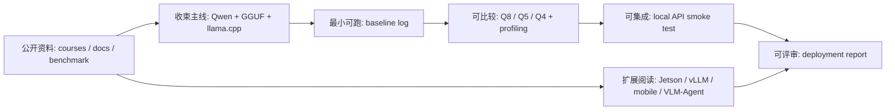

# Start Here：我该怎么学这门课

这门课只有一条主线：

```text
Qwen 小模型 -> GGUF -> llama.cpp -> Q8/Q5/Q4 -> profiling -> local API -> 部署报告
```

第一次看到这些词时，不需要先查完全部资料：

| 词 | 先这样理解 |
| --- | --- |
| Qwen 小模型 | 课程统一使用的开源 LLM 代表，用来减少模型变量。 |
| GGUF | llama.cpp 常用的本地模型文件格式，文件名里会带具体量化格式。 |
| llama.cpp | 本课程主线 runtime，用 CLI、benchmark 和 server 贯穿实验。 |
| Q8/Q5/Q4 | 三组低比特权重版本，用来比较文件大小、速度、内存和质量。 |
| profiling | 记录首 token、tokens/s、内存、温度、功耗和失败日志。 |

如果第一次打开课程，不要先读完整目录。先选一条路径，再按对应产出推进。

## 交付资料速查

| 你要做什么 | 先看 |
| --- | --- |
| 开始写最终报告 | [最终报告模板](/docs/report-template) |
| 查看真实运行证据 | [学生实跑覆盖索引](/docs/student-run-coverage) |
| 看一份完成版格式 | [完成版报告样例](/docs/example-final-report) |
| 不知道日志字段填哪 | [样例日志与结果表](/docs/sample-logs) |
| 命令失败或结果异常 | [排障索引](/docs/troubleshooting-index) |
| 确认最终验收标准 | [最终项目与验收标准](/docs/final-project) |
| 教师或助教批改 | [教师使用指南](/docs/instructor-guide) |

## 公开资料怎么转成本页路径

外部课程和官方文档很多，本页只把它们转成第一次学习的顺序：先跑通 Qwen GGUF 和 llama.cpp，再做 Q8/Q5/Q4、profiling、local API，最后写报告。资料地图和类似课程页放在后面，是为了避免新学员一开始被 vLLM、TensorRT-LLM、Jetson、移动端和 VLM/Agent 分支打散。



| 外部资料中的经典内容 | 本页吸收什么 | 学习路径里的落点 |
| --- | --- | --- |
| Hugging Face LLM Course / ML Systems Book | 先建立 token、推理指标和系统约束 | “第一次学习该做什么” |
| Qwen llama.cpp / llama.cpp 文档 | Qwen GGUF、本地 runtime、CLI/bench/server | 2 小时路径和 40 学时主线 |
| DeepLearning.AI 量化与 serving 课程 | 量化后继续 benchmark、serving 和 API 化 | 40 学时基础路径 |
| Jetson / Edge AI 资料 | 端侧功耗、温度、共享内存和迁移风险 | 60 学时完整路径 |
| MLPerf / Nsight / llama-bench | 结果要能追溯到条件和日志 | 学生实跑覆盖索引和最终报告模板 |

第一次学习时，看到外部资料可以按下面顺序处理：

| 看到的资料 | 先做什么 |
| --- | --- |
| 原理课程 | 只记住和 token、量化、runtime、profiling 相关的概念 |
| 官方命令 | 改成本课程的 Qwen GGUF / llama.cpp 命令后再运行 |
| 原图或架构图 | 先看它解释的系统边界，再回到课程 Mermaid 和表格 |
| benchmark 数字 | 只学习记录口径，不把数字写进自己的结论 |
| 新 runtime | 先问它是否能接入 Qwen 主线和最终报告证据链 |

第一次学习时可以直接把外部课程里的这些材料贴到个人笔记里，但进入课程报告前要替换成自己的记录：

| 外部材料 | 个人笔记里先贴什么 | 报告里必须换成什么 |
| --- | --- | --- |
| LLM pipeline 图 | tokenizer、model、post-processing 的流程 | 本次 Qwen prompt、参数和输出日志 |
| 量化 schemes 图 | bit-width、scale、weight-only 等关键词 | Q8/Q5/Q4 文件、hash、速度和质量 |
| benchmark lab 图 | workload、metrics、server 的字段 | 自己的 `llama-bench` 或 API smoke test |
| Jetson/edge 图 | 端侧设备和功耗约束 | 实际设备型号、温度、功耗或未测说明 |
| Agent 架构图 | tools、human confirmation、fallback | 本项目是否需要 Agent，权限边界是什么 |

所以，首次学习的原则是：先拿到一条能跑、能比较、能写报告的证据链，再回头读资料地图做扩展。

### 外部原图速览

第一次学习不需要读完所有外部课程，但可以先看这两类图：一类解释 LLM 推理链路，一类解释 serving/benchmark 课程为什么要把指标和报告连起来。


| 原图重点 | 本页先吸收什么 | 第一次学习怎么用 |
| --- | --- | --- |
| NLP pipeline | 输入、模型和后处理是一个链路 | baseline 不是只看模型输出，还要保存输入和日志 |
| Benchmarking lab | 结果必须绑定 workload、硬件、模型和参数 | 做 Q8/Q5/Q4 后必须填结果表和报告 |

## 适合谁

| 学员类型 | 建议路径 | 重点 |
| --- | --- | --- |
| 想快速判断课程是否能跑 | 2 小时路径 | 跑通 baseline，看到日志 |
| 正常课程或培训学员 | 40 学时路径 | 完成量化对比、profiling、API 和报告 |
| 研究生专题或项目制训练 | 60 学时路径 | 增加微调、Jetson、vLLM/移动端和系统复盘 |

## 需要什么基础

最低要求：

- 会在 Linux/macOS 终端执行命令。
- 能读懂 Python 基础脚本。
- 知道 LLM 是按 token 生成文本。
- 愿意保存日志和表格，而不是只看一次输出。

不要求：

- 从零训练 LLM。
- 手写 CUDA kernel。
- 完整推导 Transformer。
- 精通所有 runtime。

## 需要什么硬件

| 环境 | 能学到什么 | 限制 |
| --- | --- | --- |
| Ubuntu Server + NVIDIA GPU | 主线环境，适合完成 baseline、量化、profiling、API | 不能代表 Jetson 的功耗和温度 |
| NVIDIA Jetson | 适合观察共享内存、功耗、温度和长期稳定性 | 编译和依赖更敏感 |
| CPU-only | 可练习模型加载、CPU baseline、API 和报告结构 | 不能完整体验 GPU offload |
| Mac | 可作为补充路线，验证本地小模型体验 | 本课程主线不按 Mac 调优 |

没有 Jetson 可以学。40 学时路径可以只用 Ubuntu Server + NVIDIA GPU 或云 GPU。没有 NVIDIA GPU 也可以完成部分 CPU baseline 和报告结构训练，但需要在报告中说明限制。

## 三条学习路径

### A. 2 小时快速路径

目标：确认课程主线能跑通一次。

1. 阅读 [课程导读](/docs/intro) 和本页。
2. 完成 [Ubuntu Server 与 NVIDIA GPU 环境](/docs/lab-ubuntu-nvidia) 的环境快照。
3. 完成 [Qwen 基线推理](/docs/lab-qwen-baseline)。
4. 保存 baseline log。
5. 把环境和 baseline 填入 [最终报告模板](/docs/report-template) 的第 1-3 节。

最低产出：

```text
results/prereq-env.txt
logs/qwen-baseline-*.txt
report/final_report.md 的前 3 节草稿
```

### B. 40 学时基础路径

目标：完成端侧 Qwen 小模型部署评估报告。

1. Part I：推理指标、LLM 流程、量化数学和 Linux/GPU 工具链。
2. Part II：明确目标场景、设备约束和验收指标。
3. Part III：完成 Q8/Q5/Q4 或同类量化对比。
4. Part V/VI：完成 GPU offload、ctx-size、threads、llama-bench 和 profiling。
5. Part VI：启动本地 OpenAI-compatible API，并做 smoke test。
6. Part VII：整理最终报告。

必须产出：

```text
环境记录
baseline log
quant comparison table
profiling table
local API smoke test
final deployment report
```

### C. 60 学时完整路径

目标：在 40 学时主线基础上加入更多工程取舍。

新增内容：

- LoRA/QLoRA smoke test 和 adapter 去留判断。
- Jetson 迁移、功耗、温度和稳定性对比。
- vLLM serving、MLC LLM、LiteRT/Android 路线阅读或选做。
- VLM/Agent 系统设计和端云协同复盘。

这些内容是扩展，不改变主线报告。报告仍然要回答：在指定设备上，哪个模型、哪个量化版本、哪个 runtime 参数最值得采用，为什么。

## 第一次学习该做什么

如果是零基础，先走这条最小补课路径，不需要一次读完 Part I：

1. 在 [机器学习推理基础](/docs/ml-inference-basics) 里先看 latency、throughput、TTFT、tokens/s。
2. 在 [Transformer 与 LLM 基础](/docs/transformer-llm-basics) 里先看 token、prefill、decode、KV Cache。
3. 在 [量化数学基础](/docs/quantization-math-basics) 里先看 scale、zero-point、对称 INT8 示例和 Q4 为什么更难。
4. 看不懂的公式先标记，跑 baseline 后再回来补。

首次学习可以先跳过 [资料对比与课程取舍](/docs/source-comparison) 和 [参考资料地图](/docs/reference-map)。它们更适合教师备课、写报告引用资料或做扩展阅读时再看。

第一次打开课程，请按顺序完成：

1. 阅读本页。
2. 阅读 [环境与版本矩阵](/docs/environment-matrix)，确认自己的设备属于哪条路径。
3. 建立实验目录：

```bash
mkdir -p ~/edge-ai-lab/{env,models,repos,scripts,logs,results,report}
```

4. 保存一次环境快照。
5. 阅读 [Qwen 基线推理](/docs/lab-qwen-baseline)，准备第一次 baseline。
6. 打开 [最终报告模板](/docs/report-template)，先填项目背景和环境。

## 最终会产出什么

最终产出不是“跑通一次模型”，而是一份可评审的端侧部署评估报告。它需要说明：

- 目标设备和约束是什么。
- 为什么选择这个 Qwen 小模型和量化版本。
- 量化后如何 serving、benchmark 和 API 化。
- 哪些结果来自真实日志。
- 哪些方案不推荐，以及原因。
- 下一轮优化应该做什么。

## 参考资料

本章吸收方式：

- **知识点**：从 LLM 入门、runtime、量化、serving 和 benchmark 资料中抽出学习顺序。
- **图解**：贴入 Hugging Face pipeline 和 vLLM benchmarking 原图，并把外部资料重画为“公开资料 -> 主线 -> baseline -> 量化/profiling -> local API -> 报告”的入口路径。
- **实验**：入口页只指向已有实验章节，不新增命令。
- **取舍**：首次学习先跳过扩展资料，避免把课程展开成厂商文档索引。

- [类似教材与教程参考](/docs/similar-courses)
- [参考资料地图](/docs/reference-map)
- [Hugging Face Course documentation-images](https://huggingface.co/datasets/huggingface-course/documentation-images)
- [vLLM / DeepLearning.AI course screenshots](https://github.com/vllm-project/vllm-project.github.io/tree/main/assets/figures/2026-06-03-deeplearning-ai-course)
- [Qwen llama.cpp 本地运行指南](https://qwen.readthedocs.io/en/v2.5/run_locally/llama.cpp.html)
- [llama.cpp 项目](https://github.com/ggml-org/llama.cpp)
- [MLPerf Inference](https://mlcommons.org/benchmarks/inference/)
