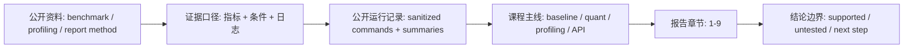

# 学生实跑覆盖索引

本页把第一轮“按学生视角从头到尾操作”的公开运行记录映射到课程结构。它不是新的实验要求，只是帮助学生和教师确认：哪些结论有真实日志支撑，哪些是 60 学时或后续扩展。

公开运行记录仓库：[edge-ai-deployment-course-runs](https://github.com/neardws/edge-ai-deployment-course-runs)

## 公开资料怎么转成本页内容

MLPerf、llama-bench、Nsight Systems 和最终报告模板强调同一件事：结论必须能回到指标、条件和日志。本页把这个证据口径落到课程自己的公开运行记录上，帮助学生判断哪些内容已经有实跑证据，哪些只能写成“未记录”“未测扩展”或“下一轮验证”。



| 外部资料中的经典内容 | 本页吸收什么 | 课程里的落点 |
| --- | --- | --- |
| MLPerf Inference | 指标和运行条件要一起出现 | 不把运行摘要当成孤立数字 |
| llama.cpp llama-bench | 标准化 benchmark 要和业务 prompt 分开解释 | Part V 推理加速覆盖说明 |
| Nsight Systems | profiling 结论要能回到资源证据 | Part V profiling 和第 7 节风险 |
| 最终报告模板 | 每个结论都要指向日志或附录 | “使用方式”的证据链 |
| 公开运行记录仓库 | 脱敏命令、环境摘要和失败边界 | 主线覆盖表 |

本页不是评分标准，也不替代学生自己的日志。它只说明：课程材料中的哪些判断已经有公开样例支撑。

## 主线覆盖

| 课程位置 | 已实跑证据 | 对应报告位置 | 结论 |
| --- | --- | --- | --- |
| Start Here / 环境建立 | [server smoke run](https://github.com/neardws/edge-ai-deployment-course-runs/tree/main/runs/2026-06-29-server-smoke) | 第 1-3 节 | 服务器环境、llama.cpp 构建、Qwen baseline 可以跑通 |
| Part I 前置工具链 | [server smoke run](https://github.com/neardws/edge-ai-deployment-course-runs/tree/main/runs/2026-06-29-server-smoke) | 第 2 节 | 环境字段、GPU、CUDA、模型 SHA256 需要从真实命令记录 |
| Part II 端侧约束 / Jetson | [Jetson login check](https://github.com/neardws/edge-ai-deployment-course-runs/tree/main/runs/2026-06-29-jetson-login-check)、[Jetson env/build preflight](https://github.com/neardws/edge-ai-deployment-course-runs/tree/main/runs/2026-06-29-jetson-env-build-preflight)、[Jetson Qwen baseline](https://github.com/neardws/edge-ai-deployment-course-runs/tree/main/runs/2026-06-29-jetson-qwen-baseline) | 第 2、7 节 | Jetson 要单独记录访问方式、JetPack/L4T、功耗模式、`tegrastats` |
| Part III 量化 | [Qwen quantization comparison](https://github.com/neardws/edge-ai-deployment-course-runs/tree/main/runs/2026-06-29-qwen-quantization-comparison) | 第 4 节 | Q4/Q5/Q8 都要同时看速度、文件大小和输出质量 |
| Part IV 微调 | [Qwen LoRA smoke run](https://github.com/neardws/edge-ai-deployment-course-runs/tree/main/runs/2026-06-29-qwen-lora-smoke) | 第 8、9 节 | 5-step LoRA 只能证明 pipeline，不证明 adapter 值得部署 |
| Part V 推理加速 | [inference acceleration server run](https://github.com/neardws/edge-ai-deployment-course-runs/tree/main/runs/2026-06-29-inference-acceleration-server) | 第 5 节 | `-ngl`、ctx、threads、`llama-bench` 要分开解释 |
| Part V Profiling | [profiling record run](https://github.com/neardws/edge-ai-deployment-course-runs/tree/main/runs/2026-06-29-profiling-record) | 第 5、7 节 | timing、显存、功耗和输出质量都要能追溯到日志 |
| Part VI 本地服务 | [Jetson local service](https://github.com/neardws/edge-ai-deployment-course-runs/tree/main/runs/2026-06-29-jetson-local-service) | 第 6、7 节 | HTTP 200 不等于答案质量合格，server 构建和端口也要记录 |
| Part VII VLM/Agent / 最终复盘 | [final agent review run](https://github.com/neardws/edge-ai-deployment-course-runs/tree/main/runs/2026-06-29-final-agent-review) | 第 7-9 节 | Agent 输出必须做 schema + policy 校验，最终建议必须回到证据 |

## 第一轮未作为必做实验的内容

| 内容 | 当前处理 |
| --- | --- |
| 完整本地 VLM 推理 | 作为 60 学时/后续扩展；第一轮只验证本地 LLM 服务和 Agent 权限边界 |
| vLLM serving | 作为扩展阅读和后续实验；第一轮主线用 llama.cpp server |
| Android / MLC / LiteRT 实机 | 作为移动端路线图；第一轮未实测 |
| TensorRT-LLM / Triton / 云端集群 serving | 不作为本课程第一轮必做路径 |
| 长时间稳定性和并发压测 | 已在风险中登记，后续需要专门实验 |

## 使用方式

学生写最终报告时，每个关键结论至少回到一条运行记录或本地日志：

```text
结论 -> 证据日志或公开运行记录 -> 风险判断 -> 下一步动作
```

如果某项没有实测，报告写“未记录”或“未做扩展”，不要用别人的数字补空格。

## 参考资料

本章吸收方式：

- **知识点**：从 benchmark、profiling 和报告模板吸收“指标、条件、日志、结论边界”这条证据口径。
- **图解**：把外部评估方法重画为“公开资料 -> 运行记录 -> 报告章节 -> 结论边界”的覆盖图。
- **实验**：本页只映射课程公开运行记录，不新增实验要求。
- **取舍**：不把公开样例数字写成学生自己的结果，也不把未测扩展伪装成已验证。

- [公开运行记录仓库](https://github.com/neardws/edge-ai-deployment-course-runs)
- [最终报告模板](/docs/report-template)
- [MLPerf Inference](https://mlcommons.org/benchmarks/inference/)
- [llama.cpp llama-bench documentation](https://www.mintlify.com/ggml-org/llama.cpp/api/tools/llama-bench)
- [NVIDIA Nsight Systems](https://developer.nvidia.com/nsight-systems)
