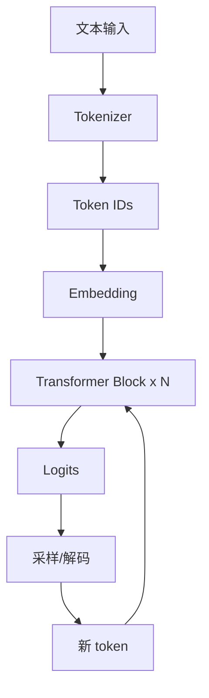
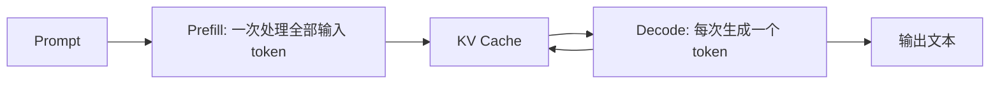

# Transformer 与 LLM 基础

## 学习目标

- 理解 token、embedding、attention、MLP、layer norm 和 decoder-only LLM 的基本关系。
- 理解 prefill、decode、KV Cache、上下文长度和 chat template 为什么影响部署。
- 为后续 GPTQ、AWQ、SmoothQuant 和 KV Cache 量化建立结构基础。

## 问题背景

LLM 部署的性能特征和传统 CNN/检测模型不同。它不是一次前向就结束，而是先处理 prompt，再逐 token 生成。生成过程中，每个新 token 都会复用历史 KV Cache。上下文越长，cache 越大；输出越长，decode 循环越久。

## 图示讲解





## 核心概念

| 概念 | 部署影响 |
| --- | --- |
| Tokenizer | tokenizer 或 chat template 错误会导致输出质量异常 |
| Attention | 长上下文会增加计算和 KV Cache 压力 |
| MLP/FFN | 大量权重集中在矩阵乘，低比特权重量化收益明显 |
| Prefill | 影响首 token 延迟，和 prompt 长度强相关 |
| Decode | 影响持续生成速度，常用 tokens/s 衡量 |
| KV Cache | 影响长上下文、多轮对话和并发显存 |

## 代码/命令示例

固定 prompt 和生成长度，才能比较 prefill 与 decode：

```bash
./build/bin/llama-cli \
  -m ~/edge-ai-lab/models/qwen/qwen2.5-1.5b-instruct-q4_k_m.gguf \
  -p "请用项目复盘的形式解释 KV Cache 对端侧部署的影响。" \
  -n 128 \
  --ctx-size 2048 \
  -ngl 99
```

改变上下文长度时，要单独记录显存变化：

```bash
# 分别尝试 1024、2048、4096，记录峰值 VRAM
--ctx-size 1024
--ctx-size 2048
--ctx-size 4096
```

## 配套实作

在 [Profiling 与结果记录](/docs/lab-profiling) 中增加一个上下文长度实验：

| ctx | 峰值 VRAM | 首 token | tokens/s | 质量备注 |
| --- | --- | --- | --- | --- |
| 1024 | 待填 | 待填 | 待填 | 待填 |
| 2048 | 待填 | 待填 | 待填 | 待填 |
| 4096 | 待填 | 待填 | 待填 | 待填 |

## 验收结果

| 产物 | 验收标准 |
| --- | --- |
| LLM 推理流程图 | 能说明 prefill 和 decode 的区别 |
| KV Cache 表 | 能说明上下文长度对显存和首 token 的影响 |
| 模板检查 | 能确认模型使用了匹配的 tokenizer/chat template |

## 常见问题

- **把模型加载时间当首 token**：首 token 应从请求开始到第一个生成 token 单独看。
- **忽略 chat template**：Instruct 模型没有正确模板时，输出风格和质量可能明显错误。
- **只量化权重不看上下文**：weight-only 降低权重显存，但 KV Cache 仍随上下文增长。

## 参考资料

- [Attention Is All You Need](https://arxiv.org/abs/1706.03762)
- [Hugging Face Transformers chat templates](https://huggingface.co/docs/transformers/chat_templating)
- [Hugging Face Transformers KV cache](https://huggingface.co/docs/transformers/kv_cache)
- [vLLM PagedAttention paper](https://arxiv.org/abs/2309.06180)
