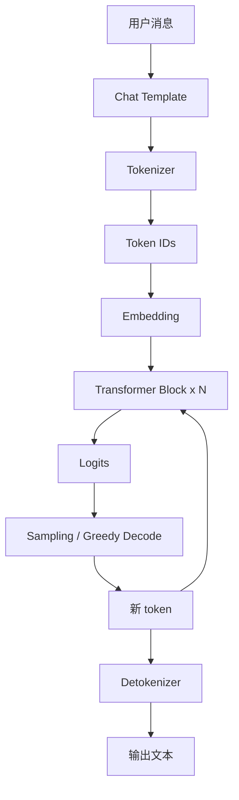
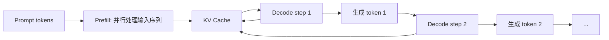
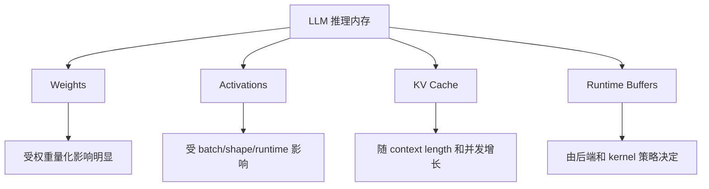

# Transformer 与 LLM 基础

## 学习目标

- 理解 token, embedding, attention, MLP, layer norm 和 decoder-only LLM 的基本关系。
- 能解释 prefill, decode, first-token latency, tokens/s 和 KV Cache 对部署的影响。
- 理解 chat template, tokenizer 和 stop token 为什么属于部署契约的一部分。
- 知道 LLM 量化为什么常从权重矩阵入手, 以及为什么 KV Cache 仍会成为长上下文瓶颈。
- 为后续 GPTQ, AWQ, SmoothQuant, llama.cpp GGUF 和 Jetson 迁移实验建立结构基础。

:::tip
本章不追求从零推导 Transformer。课程目标是让学员能读懂 LLM 部署日志, 能设计量化实验, 能解释显存和速度变化。
:::

## 问题背景

LLM 部署的性能特征和传统分类模型不同。传统分类模型通常一次前向得到结果; decoder-only LLM 需要先处理 prompt, 再逐 token 生成。生成过程中, 每个新 token 都要读取模型权重, 访问历史 KV Cache, 采样下一个 token, 再进入下一轮 decode。

因此, LLM 部署中的很多现象不能只用“模型参数量”解释:

- prompt 很长时, 首 token 延迟会增加。
- 输出很长时, decode 总时间会增加。
- 上下文变长时, KV Cache 会占用更多显存或内存。
- 权重量化后, 模型文件变小, 但 KV Cache 并不会自动随之等比例减少。
- chat template 错误时, 模型可能能运行, 但回答风格和质量明显异常。

课程使用 Qwen 小模型作为主实验对象, 是因为它既能覆盖现代 decoder-only LLM 的主要部署问题, 又能在本地 GPU 和 Jetson 上进行可操作的实验。

## 图示讲解

### Decoder-only LLM 的推理流程



这张图里最容易被忽略的是 `Chat Template`。Instruct 模型通常不是直接接收一段普通文本, 而是接收带角色标记的消息格式。模板错误会导致模型不知道哪里是 system, user, assistant, 从而影响质量评估。

### Prefill 与 Decode



Prefill 和 decode 的瓶颈不同:

- Prefill 处理整个 prompt, 更接近大矩阵计算, 与 prompt 长度强相关。
- Decode 每次只生成一个 token, 会反复读取权重和 KV Cache, 与输出长度强相关。
- 首 token 延迟通常包括请求处理, tokenizer, prefill 和第一次 decode。

### 权重, 激活与 KV Cache



这也是为什么课程后续要求分开记录模型文件大小, 运行峰值显存, 上下文长度和并发条件。

## 核心概念

### Token 与 Tokenizer

LLM 不直接处理汉字, 英文单词或句子, 而是处理 token id。Tokenizer 负责把文本转成 token id, 也负责把生成的 token id 还原成文本。

部署中要关注:

- 模型必须使用匹配的 tokenizer。
- 中文, 英文, 代码和特殊符号的 token 数可能差异很大。
- prompt 的 token 数比字符数更能解释 prefill 成本。
- stop token 和特殊 token 会影响生成停止条件。

示例检查:

```python
from transformers import AutoTokenizer

tokenizer = AutoTokenizer.from_pretrained("Qwen/Qwen2.5-1.5B-Instruct")
text = "端侧模型量化部署技术专题"
ids = tokenizer.encode(text)

print(ids)
print(len(ids))
print(tokenizer.decode(ids))
```

### Chat Template

Chat template 把多轮消息转换成模型训练时熟悉的文本格式。

```python
from transformers import AutoTokenizer

tokenizer = AutoTokenizer.from_pretrained("Qwen/Qwen2.5-1.5B-Instruct")

messages = [
    {"role": "system", "content": "你是一个端侧模型部署课程助教。"},
    {"role": "user", "content": "用两句话解释 KV Cache。"},
]

prompt = tokenizer.apply_chat_template(
    messages,
    tokenize=False,
    add_generation_prompt=True,
)

print(prompt)
```

:::caution
如果 CLI, Python 和服务端使用的 prompt 模板不一致, 同一个模型的输出质量可能无法公平比较。
:::

### Embedding

Embedding 是 token id 到向量的查表过程。它本身不是课程优化重点, 但它说明 LLM 输入已经从文本变成 tensor。后续所有 attention, MLP 和量化讨论都发生在数值张量上。

### Attention

Attention 的作用是让当前位置的表示读取上下文信息。它的核心计算是:

$$
\mathrm{Attention}(Q, K, V) = \mathrm{softmax}\left(\frac{QK^\top}{\sqrt{d_{head}}}\right)V
$$

$Q$, $K$, $V$ 由当前层输入经三个投影矩阵得到, 除以 $\sqrt{d_{head}}$ 是防止点积随维度增大而过大。部署视角下, 这个公式直接给出两个成本结论:

- prefill 时 $QK^\top$ 的计算量随 prompt 长度平方增长, 约 $O(n^2 d)$。
- decode 时每个新 token 都要和全部历史 $K$, $V$ 相乘, 这就是 KV Cache 被反复读取的原因。

GQA（grouped-query attention）让多个 query head 共享同一组 KV head。KV Cache 大小与 KV head 数成正比, KV head 从 12 个减到 2 个, cache 直接缩小 6 倍。Qwen2.5 系列就使用这种结构, 具体数字以模型 `config.json` 为准。

部署中更关心 attention 带来的成本:

- prompt 越长, prefill 越重。
- context 越长, KV Cache 越大。
- 多轮对话保留历史越多, 内存压力越大。
- 高效 attention 或 KV Cache 管理可以改善长上下文服务能力。

### MLP/FFN

Transformer block 中的 MLP/FFN 包含大量矩阵乘权重。许多权重量化方法之所以有效, 是因为它们主要压缩这些大矩阵权重。

参数量可以粗估。标准结构下每层 attention 投影约 $4d^2$, FFN 约 $8d^2$, 全模型参数约:

$$
N \approx 12\, n_{layer}\, d^2
$$

$d$ 是 hidden size, $n_{layer}$ 是层数。现代模型会有出入（GQA 减少 KV 投影, SwiGLU 的 FFN 是三个矩阵, embedding 另算）, 但这个量级估算足够回答部署问题: 模型文件大小 ≈ 参数量 × 每参数字节数。例如 1.5B 参数模型 FP16 约 3 GB, Q4_K_M 约 1 GB。拿到任何模型文件先做这道算术, 可以立刻判断文件是否完整, 量化是否生效。

### Layer Norm 与残差连接

Layer norm 和残差连接对模型数值稳定性重要。低比特量化时, 不是所有层都适合同样处理。部分方法会保留某些敏感层或使用混合精度, 以减少质量损失。

### Logits 与采样

模型输出 logits, 再通过 softmax 或采样策略选择下一个 token。temperature 的数学作用是缩放 logits:

$$
p_i = \frac{\exp(z_i / T)}{\sum_j \exp(z_j / T)}
$$

$T \to 0$ 时趋向贪心选取最大 logit, $T$ 越大分布越平, 输出越随机。这解释了为什么部署对比时要固定采样参数（量化对比建议 $T = 0$）: 否则输出差异可能来自采样随机性, 而不是量化或 runtime。

常见参数:

| 参数 | 作用 | 对实验的影响 |
| --- | --- | --- |
| temperature | 控制随机性 | 越高越发散, 越低越确定 |
| top_p | nucleus sampling | 改变候选 token 范围 |
| top_k | 限制候选数量 | 改变输出多样性 |
| max_tokens / `-n` | 生成长度 | 直接影响总耗时 |
| stop | 停止条件 | 错误时可能过早停止或不停止 |

## LLM 推理阶段与指标

| 阶段 | 输入 | 输出 | 主要指标 | 常见瓶颈 |
| --- | --- | --- | --- | --- |
| Tokenize | 文本/messages | token ids | tokenizer 时间, token 数 | Python/tokenizer CPU |
| Prefill | prompt tokens | KV Cache, 首步 logits | prompt eval, 首 token | 长 prompt, attention, GPU 利用 |
| Decode | 上一步 token + KV Cache | 新 token | tokens/s | 内存带宽, kernel, KV Cache |
| Detokenize | token ids | 文本 | 端到端延迟 | 流式输出, 字符处理 |
| Service | 请求/响应 | JSON/SSE | p50/p95, 错误率 | 队列, 并发, 超时 |

## KV Cache

KV Cache 保存每层 attention 的 key/value, 避免每次 decode 都重新计算历史 token。它是 LLM 高效生成的关键, 也是长上下文部署的主要内存来源之一。

理解 KV Cache 时要注意:

- 它与上下文长度相关。
- 它与层数, hidden size, heads 或 grouped-query attention 结构相关。
- 它与 batch 和并发相关。
- 它通常不等同于模型权重。
- 在 Jetson 上, 它会占用共享内存资源, 更容易影响系统稳定性。

实验中可以用固定模型, 固定 prompt, 改变 `--ctx-size` 观察峰值内存:

```bash
./build/bin/llama-cli \
  -m ~/edge-ai-lab/models/qwen/qwen2.5-1.5b-instruct-q4_k_m.gguf \
  -p "请解释 KV Cache 对端侧部署的影响。" \
  -n 128 \
  --ctx-size 1024 \
  -ngl 99
```

然后把 `--ctx-size` 改成 `2048`, `4096`, 记录差异。不要预先填写性能数字, 以真实设备结果为准。

## 与量化的关系

LLM 量化常见对象包括:

| 对象 | 是否常见 | 部署意义 |
| --- | --- | --- |
| Weight | 最常见 | 降低模型大小和权重读取压力 |
| Activation | 较常见 | 影响算子执行和精度, 需要校准或方法设计 |
| KV Cache | 长上下文重要 | 降低上下文内存压力, 但会影响质量和 runtime 支持 |
| Embedding/LM Head | 视方法而定 | 可能对质量敏感, 常需谨慎处理 |

权重量化能显著降低模型文件大小, 但不保证所有场景下都显著提速。提速还依赖 runtime 是否有低比特 kernel, GPU offload 是否生效, dequant 开销是否可控, 以及瓶颈是否真的在权重读取。

## 代码/命令示例

### 固定 prompt 比较模型格式

```bash
PROMPT="请用项目复盘的形式解释 KV Cache 对端侧部署的影响。"

./build/bin/llama-cli \
  -m ~/edge-ai-lab/models/qwen/qwen2.5-1.5b-instruct-q8_0.gguf \
  -p "$PROMPT" \
  -n 128 \
  --ctx-size 2048 \
  -ngl 99

./build/bin/llama-cli \
  -m ~/edge-ai-lab/models/qwen/qwen2.5-1.5b-instruct-q4_k_m.gguf \
  -p "$PROMPT" \
  -n 128 \
  --ctx-size 2048 \
  -ngl 99
```

比较时关注:

- 输出是否回答了同一问题。
- 是否出现明显重复, 幻觉或格式异常。
- 日志中的 prompt eval 和 eval 统计。
- 显存或内存占用变化。

### 固定模型比较上下文长度

```bash
MODEL=~/edge-ai-lab/models/qwen/qwen2.5-1.5b-instruct-q4_k_m.gguf
PROMPT="请解释为什么长上下文会增加端侧部署难度。"

for CTX in 1024 2048 4096; do
  ./build/bin/llama-cli \
    -m "$MODEL" \
    -p "$PROMPT" \
    -n 128 \
    --ctx-size "$CTX" \
    -ngl 99
done
```

:::note
这个循环只展示实验结构。真实课程实验中应逐次保存日志, 并同步记录 `nvidia-smi` 或 `tegrastats` 输出。
:::

## 配套实作

### 实作 1: Tokenizer 与 chat template 检查

目标: 确认本地使用的模型和 tokenizer 契约一致。

步骤:

1. 使用 Transformers 加载 Qwen tokenizer。
2. 对同一段中文 prompt 做 tokenize 和 decode。
3. 使用 `apply_chat_template` 生成 instruct prompt。
4. 保存模板输出的前后若干行。
5. 对照 llama.cpp 或服务端输入方式, 判断模板是否一致。

验收表:

| 检查项 | 结果 |
| --- | --- |
| 模型名称 | 待填 |
| tokenizer 来源 | 待填 |
| prompt token 数 | 待填 |
| chat template 是否启用 | 待填 |
| 与 CLI/API 输入是否一致 | 待填 |

### 实作 2: Prefill 与 decode 日志标注

目标: 从 llama.cpp 日志中找到 prefill 和 decode 对应指标。

步骤:

1. 固定模型和 prompt。
2. 运行一次 `-n 128`。
3. 保存日志。
4. 标注 prompt eval 和 eval。
5. 写一句话解释首 token 和 tokens/s 的差异。

### 实作 3: KV Cache 与上下文长度

目标: 观察上下文长度变化对内存的影响。

结果模板:

| 设备 | 模型 | ctx | 峰值显存/内存 | 首 token | tokens/s | 备注 |
| --- | --- | --- | --- | --- | --- | --- |
| Ubuntu GPU | 待填 | 1024 | 待填 | 待填 | 待填 | 待填 |
| Ubuntu GPU | 待填 | 2048 | 待填 | 待填 | 待填 | 待填 |
| Ubuntu GPU | 待填 | 4096 | 待填 | 待填 | 待填 | 待填 |
| Jetson | 待填 | 1024 | 待填 | 待填 | 待填 | 待填 |
| Jetson | 待填 | 2048 | 待填 | 待填 | 待填 | 待填 |

## 验收结果

| 产物 | 验收标准 |
| --- | --- |
| LLM 推理流程图 | 能说明 tokenizer, Transformer block, logits 和 sampling 的关系 |
| Prefill/decode 说明 | 能解释首 token 延迟和 tokens/s 为什么不同 |
| KV Cache 表 | 能说明上下文长度对显存/内存的影响 |
| Chat template 样例 | 能证明实验使用的输入格式与模型契约匹配 |
| 量化关系说明 | 能解释为什么权重量化不等于解决所有内存问题 |

## 常见问题

### Token 数和字数是一回事吗?

不是。不同 tokenizer 对中文, 英文, 数字, 代码和符号的切分方式不同。部署实验要记录 token 数, 不能只记录字符数。

### 为什么 Instruct 模型需要 chat template?

Instruct 模型通常按带角色的对话格式训练。直接输入普通文本可能仍然有输出, 但不一定符合模型训练时的输入分布。

### KV Cache 是不是越大越好?

不是。更大的 context 允许更长输入, 但会增加内存占用和访问成本。端侧设备上需要根据任务选择合理上下文长度。

### 量化会影响 KV Cache 吗?

权重量化主要影响 weights。KV Cache 是否量化取决于 runtime 和方法支持。即使权重是 INT4, KV Cache 也可能仍以 FP16 或其他格式存储。

### 为什么同样参数在 Ubuntu GPU 和 Jetson 上表现不同?

硬件内存结构, 带宽, 功耗模式, CUDA/JetPack 版本和散热条件都可能不同。服务器上的最优参数不一定能直接迁移到 Jetson。

## 作业

### 阅读题

1. 阅读 Attention Is All You Need 第 3.2 节, 说明 scaled dot-product attention 中 $\sqrt{d}$ 缩放的目的。

### 检查题

1. 用 $N \approx 12\,n_{layer}\,d^2$ 估算一个 28 层, hidden size 1536 的模型参数量, 与 Qwen2.5-1.5B 的实际参数量对比, 说明偏差来源。
2. 解释 GQA 为什么能成倍减小 KV Cache, 却不会等比例减小模型参数量。
3. temperature 取 0 和 0.8 对量化对比实验各有什么影响? 哪个适合做基线?

### 实验题

1. 完成实作 1, 并比较同一段中文与其英文翻译的 token 数, 解释两者 prefill 成本差异。
2. 完成实作 3, 用 KV Cache 估算公式（见[大模型量化与 KV Cache](/docs/llm-quantization)）验证 ctx 从 1024 到 4096 的显存增量是否符合线性预期。

## 参考资料

- [Attention Is All You Need](https://arxiv.org/abs/1706.03762)
- [Hugging Face Transformers chat templates](https://huggingface.co/docs/transformers/chat_templating)
- [Hugging Face Transformers KV cache](https://huggingface.co/docs/transformers/kv_cache)
- [Qwen llama.cpp local run guide](https://qwen.readthedocs.io/en/v2.5/run_locally/llama.cpp.html)
- [Qwen llama.cpp quantization guide](https://qwen.readthedocs.io/en/v2.5/quantization/llama.cpp.html)
- [vLLM PagedAttention paper](https://arxiv.org/abs/2309.06180)
- [llama.cpp project](https://github.com/ggml-org/llama.cpp)
