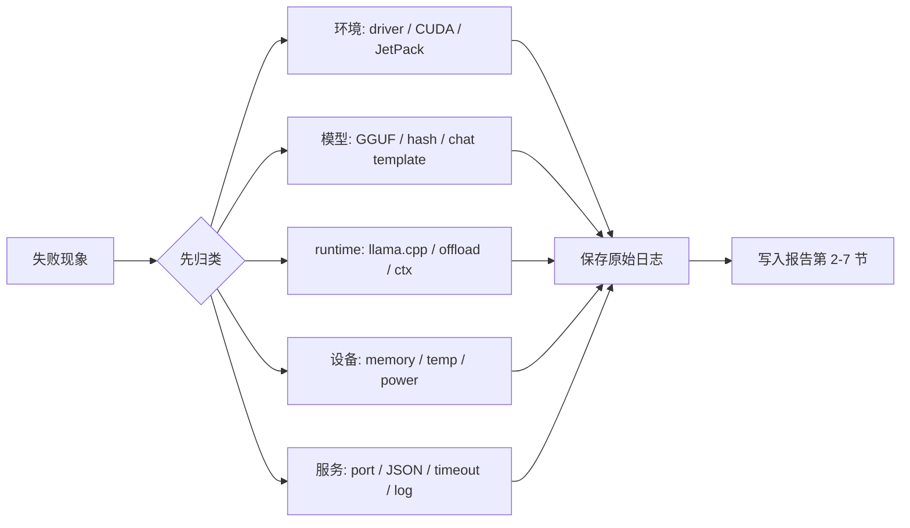

# 排障索引

先按现象定位，再回到对应实验页。不要一开始就重装环境。

## 公开资料怎么转成本页排障

外部文档通常按工具或平台写排错：CUDA 文档看驱动，llama.cpp 文档看构建和模型参数，Jetson 文档看 JetPack、功耗和温度，benchmark/profiling 资料看指标和日志。本页把这些排错入口改写成课程自己的闭环：现象先归类，再回到 Qwen、GGUF、llama.cpp、Q8/Q5/Q4、profiling、local API 和最终报告。

下面两张原图来自 [Hugging Face Course documentation-images dataset](https://huggingface.co/datasets/huggingface-course/documentation-images)，许可为 Apache-2.0。它们不是本课程的 Qwen 报错截图，但适合提醒学生：排障要先保留完整 traceback，并确认模型 ID、路径和文件名。

| 外部资料中的排错入口 | 本页改写成什么 | 最终报告里的作用 |
| --- | --- | --- |
| Ubuntu / CUDA / PyTorch 文档 | 先分清 driver 可见、CUDA toolkit 可见、框架可用三件事 | 第 2 节环境限制 |
| Qwen / llama.cpp 文档 | 模型路径、GGUF 完整性、runtime commit 和启动参数要一起查 | 第 3/4/5 节实验失败说明 |
| Jetson / JetPack 文档 | Jetson 问题优先查 L4T、功耗模式、统一内存、温度和存储 | 第 2 节环境、第 7 节温度/功耗风险 |
| llama-bench / Nsight / MLPerf | 性能问题先保留条件和原始日志，再判断瓶颈 | 第 5 节 profiling、第 7 节风险 |
| llama.cpp server / API 文档 | API 问题要区分服务启动、HTTP 状态、JSON 响应和模型质量 | 第 6 节 local API、第 7 节并发/超时风险 |

### 外部排障资料可直接吸收的记录法

公开工具文档和课程里的排障示例有一个共同点：先保存“现场”，再解释原因。本课程把这个做法压成下面的最小证据包，任何失败都优先按这个包记录。

| 失败层 | 最小证据包 | 不要只写 |
| --- | --- | --- |
| 环境层 | OS、driver/CUDA/JetPack、`nvidia-smi` 或 `tegrastats`、安装/构建日志 | “环境不行” |
| 模型层 | 模型名、文件路径、文件大小、SHA256、许可证、加载日志 | “模型加载失败” |
| runtime 层 | llama.cpp commit、构建参数、启动命令、stderr timing、`-ngl`、`ctx-size` | “llama.cpp 报错” |
| 性能层 | workload、prompt token、生成 token、重复次数、资源采样、`llama-bench` | “速度慢” |
| API 层 | server 命令、request、response、HTTP 状态、elapsed、server log | “API 不通” |
| 质量层 | prompt ID、Q8/Q5/Q4 输出摘录、判断标准、是否可复现 | “回答不好” |

官方排障文档里的命令很多，本课程只吸收能进入证据包的最小项：

| 官方资料常见检查 | 本课程保留字段 | 对应问题 |
| --- | --- | --- |
| driver / CUDA 检查 | `nvidia-smi`、driver、CUDA runtime、`nvcc` 是否存在 | GPU 可见但构建或运行失败 |
| model download / file list | 文件名、大小、SHA256、许可证、模型卡 | 模型路径或来源不明 |
| runtime verbose log | commit、build flags、backend、offload、fallback | 同一命令不同机器结果不同 |
| benchmark command | workload、ctx、生成长度、重复次数、日志路径 | 速度数字不可比较 |
| device monitor | VRAM/RAM、温度、功耗、采样时间 | OOM、热降频、短运行采样失真 |
| API debug | endpoint、request body、HTTP status、response、server stderr | API 200 但质量差或服务超时 |

如果证据包不完整，报告里先写“无法判断原因”，不要急着把问题归因到量化、模型或硬件。

排障不是额外作业。它是部署报告的证据来源：解决了的问题写进实验结论，未解决的问题写进风险登记。

| 现象 | 先看什么 | 常见原因 | 报告位置 / 第 7 节风险项 | 回看章节 |
| --- | --- | --- | --- | --- |
| CUDA 找不到 | `nvidia-smi`、CMake 日志 | 驱动可见但开发库缺失 | 第 2 节环境限制；未解决再写内存/显存或 runtime 风险 | [Ubuntu 环境](/docs/lab-ubuntu-nvidia) |
| `llama-cli` 不存在 | `build/bin` | 构建失败或路径不对 | 附录失败日志；影响实验完成时写 runtime 风险 | [Qwen 基线推理](/docs/lab-qwen-baseline) |
| 模型文件缺失或加载失败 | `ls -lh ~/edge-ai-lab/models/qwen/*.gguf`、`-m` 参数、文件大小、来源、SHA256 | 未下载、路径错误、GGUF 下载不完整或版本不兼容 | 第 3 节写“缺失/失败”；最终验收前必须补模型文件和成功 baseline | [Qwen 基线推理](/docs/lab-qwen-baseline) |
| baseline 命令执行失败 | baseline 日志、stderr、模型输出 | OOM、fallback、unsupported、CUDA offload 参数不匹配 | 第 3 节 baseline 失败；第 7 节按内存/显存或 runtime 风险登记 | [Qwen 基线推理](/docs/lab-qwen-baseline) |
| baseline 命令一直停在 `>` 提示符 | 是否用了 `llama-cli --no-conversation`，日志是否提示 `please use llama-completion instead` | 当前 llama.cpp 版本进入了交互模式 | 第 3 节写 baseline 命令失败；改用 `llama-completion -cnv -st` 后重跑 | [Qwen 基线推理](/docs/lab-qwen-baseline) |
| Jetson SSH 返回 `Permission denied` | 账号、SSH key、密码、是否能本机登录 | 课程账号未配置、key 未下发、root 登录被禁用 | 第 2 节写“Jetson 登录未通过”，不要伪造环境结果 | [Jetson 环境](/docs/lab-jetson-setup) |
| Jetson 只能通过网关访问 | 教师给的是 ProxyJump 还是先登录网关再登录 Jetson | 本机 key 和网关上的 key 不同 | 第 2 节写明访问方式，不公开内网地址 | [Jetson 环境](/docs/lab-jetson-setup) |
| Jetson 上 `nvcc` 找不到 | `/usr/local/cuda*`、`find /usr/local -name nvcc` | CUDA 已装但不在默认 `PATH` | 第 2 节写 CUDA 路径；构建前导出 PATH | [Jetson 环境](/docs/lab-jetson-setup) |
| Jetson CUDA 构建特别慢 | CMake 日志里的 `CMAKE_CUDA_ARCHITECTURES` | 默认编译了多套 CUDA 架构 | 第 7 节写构建风险；Orin 先用 `-DCMAKE_CUDA_ARCHITECTURES=87` | [Jetson 环境](/docs/lab-jetson-setup) |
| 构建 `llama-server` 特别慢 | 构建日志是否进入 `npm install` 或 `vite build` | 当前 llama.cpp server 目标会构建 Web UI 资产 | 第 6 节写构建耗时；课堂演示前提前构建 | [本地 API](/docs/lab-local-service) |
| 首 token 很慢 | prompt eval、prompt 长度 | prefill 成本、冷启动、长上下文 | 第 3/5 节指标；第 7 节写长上下文或并发/超时风险 | [机器学习推理基础](/docs/ml-inference-basics) |
| tokens/s 很低 | eval time、GPU 是否参与 | CPU fallback、低比特 kernel 不匹配 | 第 5 节加速实验；第 7 节写 runtime/GPU offload 风险 | [推理加速实验](/docs/lab-inference-acceleration) |
| Q4 更小但不更快 | offload 日志、kernel 支持 | 反量化开销或瓶颈不在权重读取 | 第 4 节量化判断；第 7 节写性能或输出质量风险 | [推理加速基础](/docs/inference-acceleration) |
| 量化后质量下降、重复或不满足固定 prompt | 固定 prompt、Q8/Q5/Q4 输出对比 | 低比特误差、采样参数、模型不匹配 | 第 4 节质量观察；第 7 节写输出质量风险 | [Qwen 量化对比](/docs/lab-qwen-quantization) |
| 显存或内存爆 | `ctx-size`、KV Cache、资源监控 | 上下文过长、模型过大、系统进程占用 | 第 7 节写内存/显存 + 长上下文风险 | [大模型量化与 KV Cache](/docs/llm-quantization) |
| 输出乱码或风格异常 | tokenizer、chat template | 模型不是 instruct 版或模板不一致 | 第 7 节写输出质量风险 | [Transformer 与 LLM 基础](/docs/transformer-llm-basics) |
| `nvidia-smi` 可见 GPU 但 PyTorch CUDA 不可用 | `torch.__version__`、`torch.version.cuda`、driver CUDA | PyTorch CUDA 构建版本高于驱动支持版本 | 第 2 节写环境限制；换兼容环境或重装匹配 PyTorch | [Qwen LoRA 微调](/docs/lab-qwen-lora-finetuning) |
| `SFTTrainer` 不接受 `dataset_text_field` | TRL 版本、报错栈 | TRL API 变更，旧参数应放到 `SFTConfig` | 第 9 节附失败日志；更新脚本后重跑 smoke test | [Qwen LoRA 微调](/docs/lab-qwen-lora-finetuning) |
| API 无响应 | server 日志、端口、host | 服务未启动、端口不一致、防火墙 | 第 6 节服务失败；第 7 节写并发/超时或安全风险 | [本地 API](/docs/lab-local-service) |
| API 返回非 200 或非 JSON | `api-curl-meta.txt`、`api-curl-response.json`、server 日志 | endpoint 路径、请求 JSON、模型未加载、服务端异常 | 第 6 节写失败；附 HTTP 状态、响应 JSON/原始响应和 server 日志 | [本地 API](/docs/lab-local-service) |
| API 返回 200 但答案明显错误 | 固定 prompt、响应正文、server timing | 服务可用不代表模型质量合格，可能是模型太小、量化损失或 prompt 不适合 | 第 6 节写服务成功；第 4/7 节写质量风险 | [本地 API](/docs/lab-local-service) |
| API 成功但很慢或超时 | server 日志、请求耗时、模型加载 | 冷启动、请求排队、上下文过长 | 第 6 节服务记录；第 7 节写并发/超时风险 | [本地 API](/docs/lab-local-service) |
| timing 解析结果全空 | stdout/stderr 是否分开保存、日志里是否有 `eval time` | llama.cpp timing 可能写到 stderr；或版本字段不同 | 第 5 节写解析限制；改用 `2>&1 | tee` 或解析 stderr 日志 | [Profiling](/docs/lab-profiling) |
| `nvidia-smi` 显示 GPU 利用率 0% | 采样间隔、推理持续时间、显存/功耗变化 | 运行太短，采样错过峰值 | 第 5 节写监控限制；用更长生成或 `llama-bench` 重测 | [Profiling](/docs/lab-profiling) |
| Agent policy JSON 合法但权限冲突 | `allowed_tools`、`confirm_required`、`blocked_tools` 是否重叠 | 小模型只满足格式，没满足权限约束 | 第 7 节写安全风险；先跑 policy validator，不执行工具 | [VLM/Agent](/docs/vlm-agent) |
| Jetson 速度越跑越慢 | `tegrastats`、温度、功耗模式 | 热降频、电源或散热不足 | 第 7 节写温度/功耗风险；RAM 接近上限时补内存风险 | [Jetson 环境](/docs/lab-jetson-setup) |
| 模型许可证未记录 | 模型卡、教师说明、下载来源 | 来源不清或离线包缺说明 | 第 2 节写未记录；第 7 节写许可证风险 | [Qwen 基线推理](/docs/lab-qwen-baseline) |
| 服务端口暴露到公网 | host、端口、防火墙 | 绑定 `0.0.0.0` 且无鉴权 | 第 7 节写安全和日志风险 | [本地 API](/docs/lab-local-service) |
| 日志含敏感输入 | prompt、请求 JSON、server 日志 | 未脱敏记录用户输入 | 第 7 节写安全和日志风险，附录只放脱敏摘要 | [本地 API](/docs/lab-local-service) |
| 需要云端兜底但未验证 | fallback 触发条件、网络、错误处理 | 只做了本地单机 smoke test | 第 7 节写端云 fallback 风险 | [最终项目](/docs/final-project) |

## 排障顺序

1. 保存原始日志。
2. 判断是环境、模型、runtime、参数还是服务层问题。
3. 先判断它属于报告第 2/3/4/5/6 节的哪类实验结果，再判断是否需要进入第 7 节风险登记表。
4. 只改变一个变量重试。
5. 在报告中记录失败现象、证据日志、影响和下一步。

失败日志不是脏数据。端侧部署报告需要失败样例来说明边界。

## 参考资料

本章吸收方式：

- **知识点**：从 CUDA、Jetson、llama.cpp、profiling 和 API 文档中吸收按层定位故障的边界。
- **图解**：直接嵌入 Hugging Face Apache-2.0 traceback / wrong model id 原图，再重画为“现象 -> 归类 -> 原始日志 -> 报告风险”的 Mermaid 图。
- **实验**：所有排障建议都回到 Qwen GGUF、Q8/Q5/Q4、profiling、local API 或最终报告字段。
- **取舍**：不复制厂商排错手册，不把重装环境当默认答案，也不引入自动诊断工具。

- [参考资料地图](/docs/reference-map)
- [样例日志与结果表](/docs/sample-logs)
- [Hugging Face Course documentation-images dataset](https://huggingface.co/datasets/huggingface-course/documentation-images)
- [Profiling 与结果记录](/docs/lab-profiling)
- [本地 API 服务实验](/docs/lab-local-service)
- [Jetson 环境与 Qwen 迁移](/docs/lab-jetson-setup)
- [Qwen llama.cpp 本地运行指南](https://qwen.readthedocs.io/en/v2.5/run_locally/llama.cpp.html)
- [llama.cpp server](https://github.com/ggml-org/llama.cpp/tree/master/tools/server)
- [NVIDIA Jetson documentation](https://docs.nvidia.com/jetson/)
- [NVIDIA Nsight Systems](https://developer.nvidia.com/nsight-systems)
- [MLPerf Inference](https://mlcommons.org/benchmarks/inference/)
